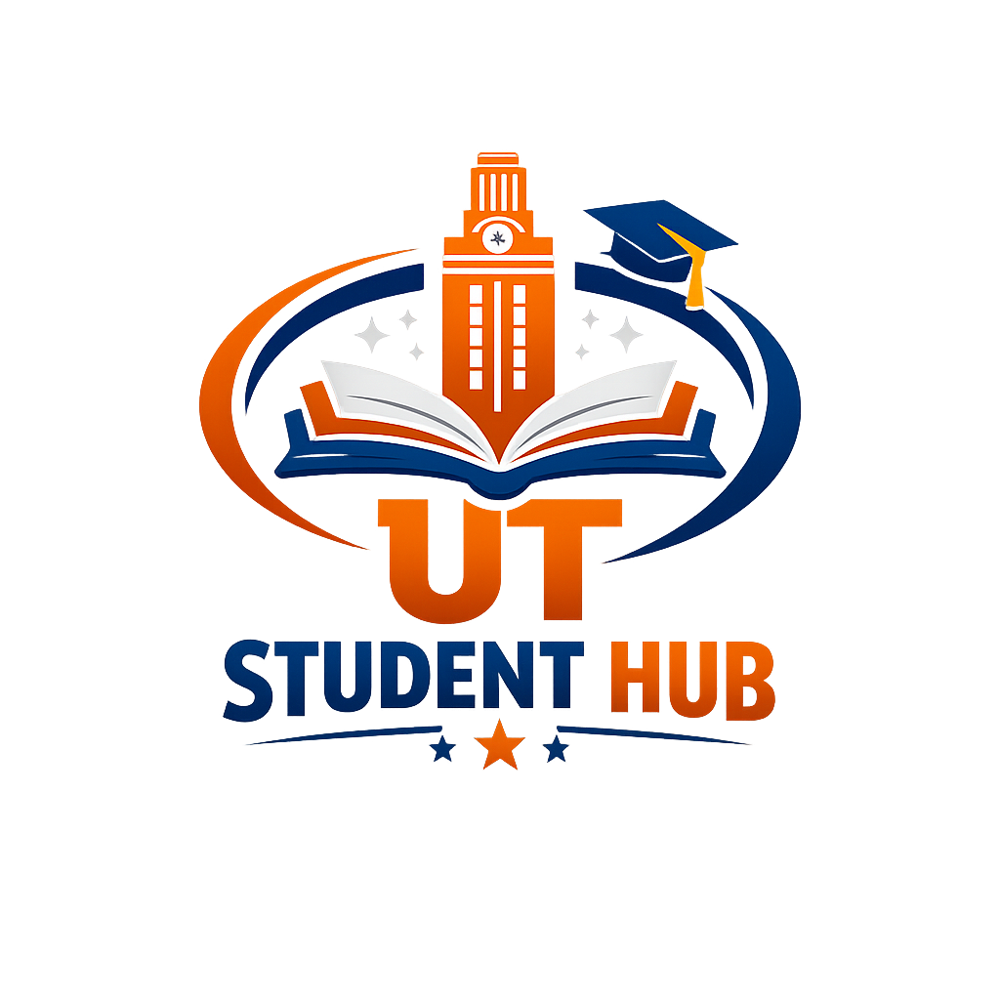

# 

[](https://flutter.dev)
[](https://supabase.com)

**ut-student-hub** adalah aplikasi pendamping mahasiswa Universitas Terbuka yang dirancang untuk memusatkan segala kebutuhan akademik dalam satu tempat. Mulai dari manajemen catatan kuliah hingga akses cepat ke berbagai portal akademik UT.

## 🚀 Fitur Utama

- **Centralized Knowledge Base:** Sistem pencatatan materi kuliah berbasis Markdown. Menggunakan *Infinite Scroll pagination* untuk performa yang optimal dan efisien.
- **Integrated Academic Portals:** Akses cepat ke MyUT, E-Learning (Tuton), SIA, dan Perpustakaan Digital melalui *In-App WebView* terintegrasi.
- **Profile Management:** Pengaturan profil dinamis yang terintegrasi dengan Supabase Auth dan Storage untuk sinkronisasi data mahasiswa secara real-time.
- **Responsive Dark Mode:** Antarmuka modern yang mendukung tema gelap untuk kenyamanan belajar.

## 🛠️ Tech Stack

- **Framework:** Flutter
- **Backend:** Supabase (Database, Auth, Storage)
- **Key Libraries:** `infinite_scroll_pagination`, `flutter_markdown_plus`, `flutter_inappwebview`, `google_fonts`.

## 📦 Instalasi & Setup

1. **Clone repository:**
   ```bash
   git clone [https://github.com/ramhandean/ut-student-hub.git](https://github.com/ramhandean/ut-student-hub.git)
2. **Install dependencies:**
    ```bash
    flutter pub get
3. **Konfigurasi Database:** Gunakan file `ut_notes_backup.sql` yang tersedia di root folder ini untuk menduplikasi struktur tabel dan kebijakan keamanan (RLS) pada project Supabase baru Anda.
4. **Inisialisasi API:**
   Update `Supabase.initialize` pada `lib/main.dart` dengan URL dan Anon Key project Anda.
5. **Jalankan aplikasi:**
    ```bash
    flutter run
---

**Status Project:** *Archived* Dibuat oleh [Dean Ramhan](https://www.google.com/search?q=https://engineroom.my.id) sebagai bagian dari pengembangan ekosistem aplikasi pendukung mahasiswa Universitas Terbuka.
